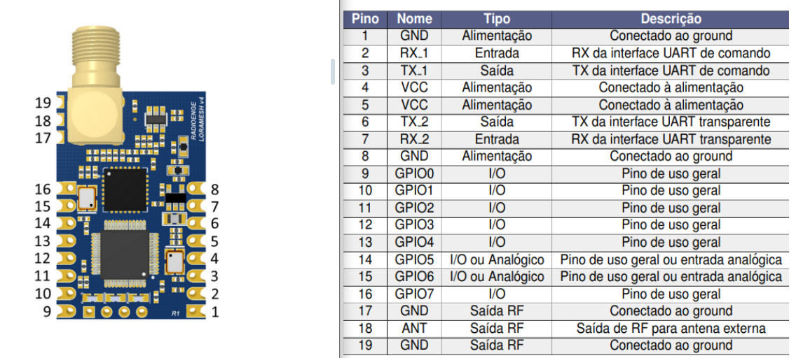
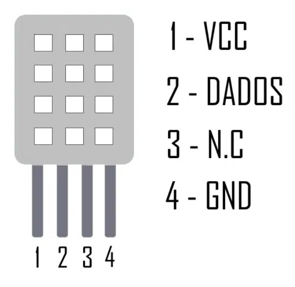
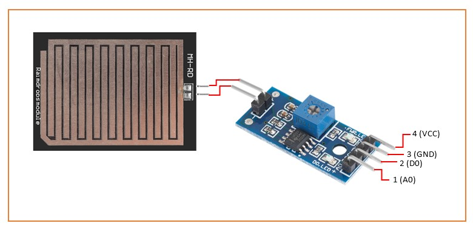

# Cobra Norato: Sistema de Monitoração de Alagamentos

## Materiais
 - 2x Módulo LoRa Mesh
 - 1x ESP32
 - 1x DHT22
 - 1x Sensor de Chuva
 - 1x HC-SR04

### Pinout do módulo LoRa Mesh

### Pinout do ESP32-Wroom

### Pinout dos Sensores:
#### Sensor de Umidade e Temperatura DHT22

#### Sensor de Chuva

#### Sensor Ultrassônico HC-SR04

## Servidor
Para executar o servidor desta aplicação, siga os passos abaixo:

### Pré-requisitos
Certifique-se de que o **Docker** está instalado na sua máquina. Se não estiver, você pode baixá-lo e instalá-lo em [https://www.docker.com/products/docker-desktop](https://www.docker.com/products/docker-desktop).

### 1. Baixe a imagem da aplicação
Execute o comando abaixo para baixar a imagem Docker disponibilizada no Docker Hub:
~~~bash
docker pull mercydiniz/cobra_norato:1.1
~~~

### 2.  Verifique se a imagem foi baixada corretamente e se existem contêineres em execução
~~~bash
docker images
~~~

~~~bash
docker ps -a
~~~

### 3. Crie um contêiner com a imagem baixada
Crie um contêiner com a imagem mercydiniz/cobra_norato e exponha as portas necessárias:
~~~bash
docker run -it --name cobra_norato_container -p 8086:8086 -p 1883:1883 mercydiniz/cobra_norato
~~~
### 4. Execute o script de inicialização
Após o contêiner ser iniciado, execute o script de inicialização da aplicação:
~~~bash
cd /home/CobraNorato/config
./influxdb_setup.sh 
~~~

### 5. API HTTP do InfluxDB
No navegado de sua escolha, acesse:
~~~bash
http://localhost:8086
~~~
E faça login.

## Referências

- [LoRa Mesh da Radioenge - Tutorial Completo](https://elcereza.com/lora-mesh-da-radioenge-tutorial-completo/)

- [Biblioteca Radioenge/LoRaMESH (commit certo) ](https://github.com/Radioenge/LoRaMESH/tree/8dce7ac00b998e5f33241d6e180f50132d5f9b98)

- [Software para configurar o módulo LoRa](https://www.radioenge.com.br/wp-content/uploads/2023/08/loramesh_v2r7p0-1.zip)

- [Sensores DHT11 e DHT22: Guia Básico dos Sensores de Umidade e Temperatura](https://blog.eletrogate.com/sensores-dht11-dht22/)

- [Datasheet DHT da AOSONG](https://www.makerhero.com/img/files/download/DHT22-AM2302-Datasheet.pdf)

- [Artigo: "Como utilizar o sensor de chuva com Arduino" - Blog da Robótica](https://www.blogdarobotica.com/2024/02/23/como-utilizar-o-sensor-de-chuva-com-arduino/)

- [Artigo: "Como conectar o Sensor Ultrassônico HC-SR04 ao Arduino" - Maker Hero](https://www.makerhero.com/blog/sensor-ultrassonico-hc-sr04-ao-arduino/)

- [Datasheet do HC-SR04 da Elec Freaks](https://d229kd5ey79jzj.cloudfront.net/620/HCSR04.pdf)

- [Biblioteca Ultrasonic](https://github.com/MakerHero/Ultrasonic)